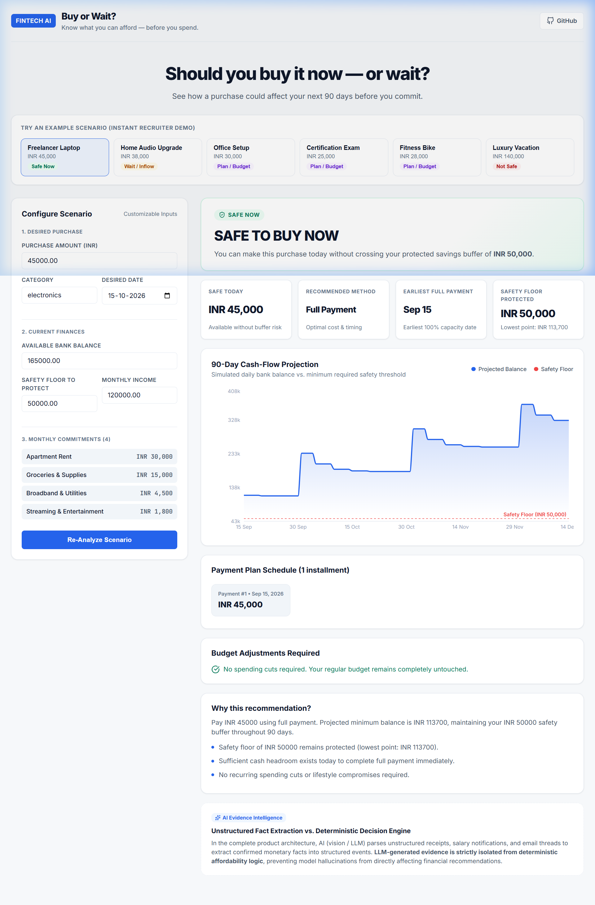
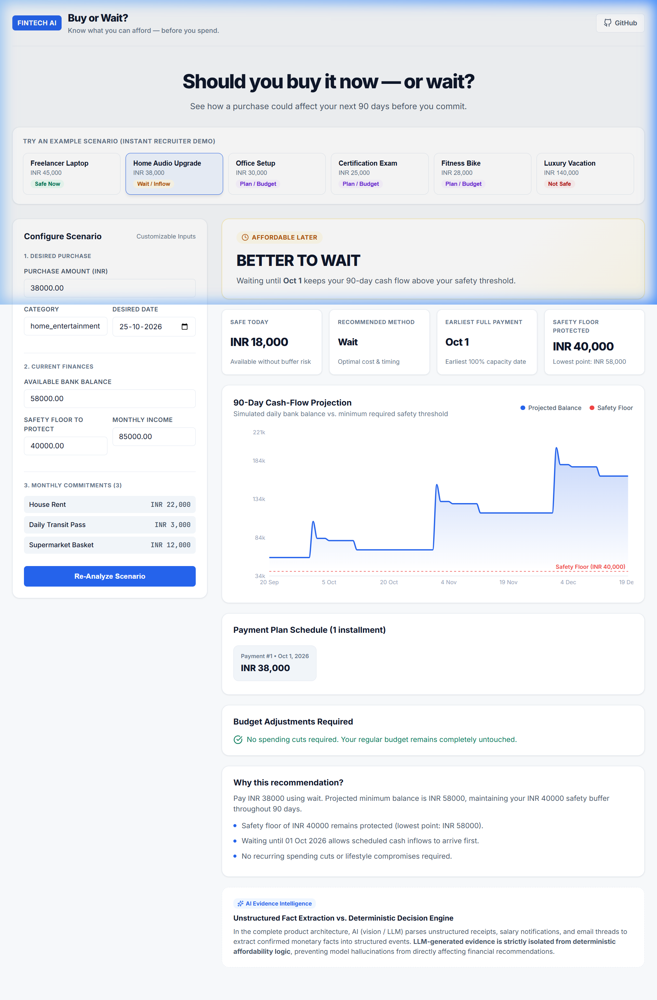
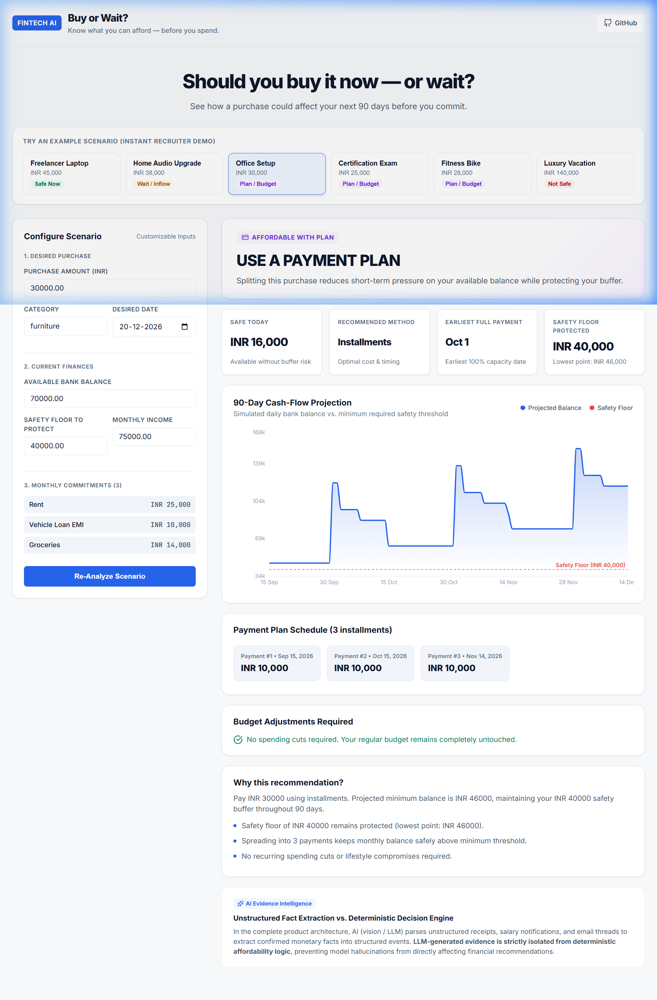
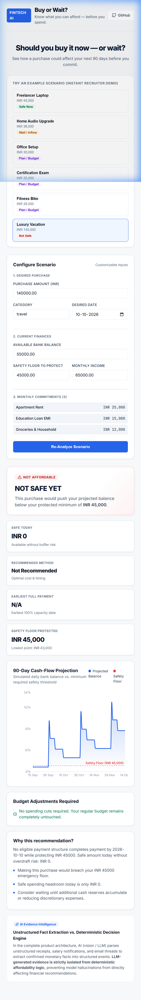

# Buy or Wait?

> **Know what you can afford — before you spend.**
> An AI-assisted financial decision engine that evaluates purchases against 90 days of simulated forward cash flow to recommend whether to buy now, wait for upcoming income, spread payments into a plan, or avoid the purchase to protect essential emergency reserves.



[](https://www.python.org/)
[](https://fastapi.tiangolo.com/)
[](https://react.dev/)
[](https://www.typescriptlang.org/)
[](#automated-tests)
[](LICENSE)

---

## What It Does

Checking today's bank account balance before making a purchase is misleading. A user might have enough cash in their account this morning, but scheduled rent, loan payments, and grocery expenses over the next two weeks will plunge them into an overdraft.

**Buy or Wait?** solves this by:
1. **Simulating 90 days of forward cash flow** based on recurring income and expense cadences.
2. **Guarding an emergency safety floor** specified by the user (e.g. minimum ₹40,000 kept intact).
3. **Evaluating all available payment mechanisms**:
   - `full_payment` (Safe today)
   - `wait` (Safe on a future date post-income)
   - `installments` (Safe via financing without buffer breach)
   - `partial_payment` (Pay safe headroom today, balance post-payday)
   - `spending_changes` (Pause subscriptions or reduce dining out to unlock purchase)
4. **Providing visual interactive feedback** via a responsive React dashboard.

---

## The Interesting Part

Traditional affordability checkers rely on a simplistic snapshot:
```text
account_balance >= purchase_price
```

**Buy or Wait?** calculates dynamic capacity over a rolling 90-day simulation:
```text
current_balance
+ confirmed_future_income
- essential_commitments (rent, loans, utilities)
- recurring_living_expenses
- candidate_payment_schedule
>= protected_savings_buffer
```
across every single day in the 90-day simulation window. If a buffer breach is detected on *any* date, the candidate plan is rejected and alternative structures (such as delaying the purchase or splitting it into an installment plan) are explored.

---

## Where AI Is Used

A core architectural principle separates uncertainty from mathematics:

| Layer | Responsibility | Technology |
| :--- | :--- | :--- |
| **Evidence Intelligence** | Parses unstructured receipts, messages, and payroll notices to extract confirmed financial facts | Vision LLM / Semantic Rule Parsers |
| **Financial Engine** | Simulates 90-day balances, computes headroom, searches optimal plan | 100% Deterministic Python |
| **Safety Validator** | Replays cash flow independently to verify buffer protection | Pure Deterministic Python |

> [!IMPORTANT]
> **AI Evidence Isolation**: LLM-generated evidence is isolated from deterministic affordability logic, reducing the impact of model hallucinations on financial recommendations. Affordability and payment plans are calculated deterministically in Python. The LLM is never permitted to calculate affordability, payment amounts, or safety thresholds.

---

## Interface Previews

| Better to Wait Scenario | Payment Plan Timeline | Mobile Responsive (390px) |
| :---: | :---: | :---: |
|  |  |  |

---

## Tech Stack

* **Frontend**: React 19, TypeScript, Vite, Recharts, Lucide Icons, Custom Modern CSS
* **Backend**: Python 3.14, FastAPI, Pydantic v2, Uvicorn
* **Algorithms**: Linear cash simulation, stream recurrence inference, candidate ranking optimization

---

## Quick Start (Running Locally)

### 1. Backend (FastAPI)

```bash
cd buy-or-wait
pip install -r backend/requirements.txt
python -m backend.app.main
```
The API server starts at `http://localhost:8000`.
Interactive OpenAPI docs are available at `http://localhost:8000/docs`.

### 2. Frontend (React + Vite)

```bash
cd buy-or-wait/frontend
npm install
npm run dev
```
Open `http://localhost:5173` in your browser.

---

## API Endpoints

| Method | Endpoint | Description |
| :--- | :--- | :--- |
| `GET` | `/api/health` | Service health status and engine version |
| `GET` | `/api/scenarios` | Summary of 6 curated demo scenarios |
| `GET` | `/api/scenarios/{id}` | Detailed scenario data |
| `POST` | `/api/analyze` | Run 90-day simulation and get payment recommendation |

---

## Automated Tests

Run the complete backend test suite:
```bash
python -m unittest discover -s buy-or-wait/backend/tests -p "test_*.py"
```

**Test Coverage**:
* **67 passing tests** covering:
  * Full payment, wait, partial payment, and installment optimization
  * Discretionary spending reduction and stop mechanics
  * 90-day minimum balance safety protection
  * Stream cadence inference (weekly, monthly, calendar-day)
  * FX currency conversions
  * Unstructured evidence parsing & validation
  * FastAPI endpoints, JSON schemas, and deterministic reproducibility

---

## Synthetic Demo Scenarios

The application ships with 6 curated synthetic scenarios demonstrating different real-world outcomes:

1. **Freelancer Laptop**: High balance, safe to buy immediately (`safe_now`).
2. **Home Audio Upgrade**: Tight balance today, safe after next salary deposit (`affordable_later`).
3. **Office Setup**: Zero-penalty 3-month installment plan preserves emergency savings (`affordable_with_plan`).
4. **Certification Exam**: Partial payment today, balance scheduled post-payday (`affordable_with_plan`).
5. **Fitness Bike**: Achievable by trimming flexible dining and pausing streaming (`affordable_with_plan`).
6. **Luxury Vacation**: Purchase exceeds 90-day cash capacity and breaches safety reserve (`not_affordable`).

---

## Deployment Options

* **Frontend**: Ready for deployment to **Vercel** or **Netlify**. Set `VITE_API_BASE_URL` to point to the backend URL.
* **Backend**: Ready for deployment to **Render** or **Railway**.
  * Start command: `uvicorn backend.app.api:app --host 0.0.0.0 --port $PORT`
  * Set `FRONTEND_ORIGIN` to your deployed frontend domain.

---

## Limitations

* **Educational / Demonstration Use Only**: This product is a simulation engine and does not constitute formal financial advice.
* **Forecast Quality**: Cash-flow simulations depend strictly on the accuracy and completeness of supplied balances, incomes, and commitments.
* **Evidence Extraction**: When no vision API is configured, supported evidence patterns use deterministic extraction; unsupported unstructured evidence returns a clear notification instead of inventing financial data.
* **Synthetic Scenarios**: Demo scenarios are realistic but synthetic demonstrations of decision engine behavior.

---

## Disclaimer

For educational and demonstration purposes only. This application does not constitute professional financial advice.

---

## License

MIT License.
