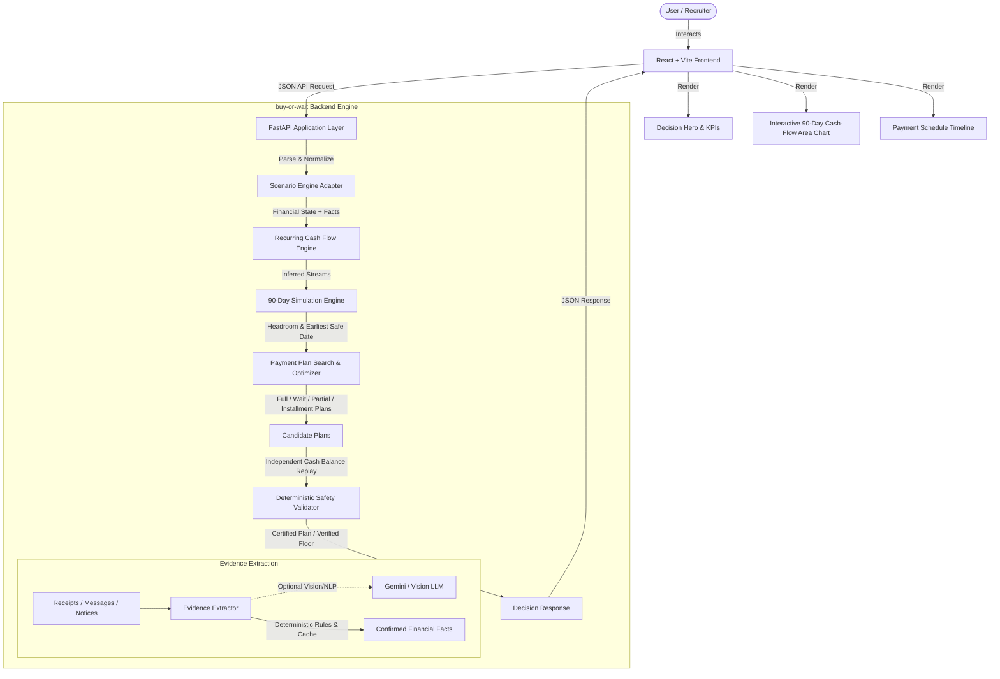

# BUY OR WAIT? — ARCHITECTURE & TECHNICAL DESIGN

## Executive Summary

**Buy or Wait?** is an AI-assisted financial decision engine designed to evaluate whether a consumer can safely afford a purchase today, pay via installments, wait for upcoming income, or avoid the purchase entirely to protect their minimum emergency safety buffer.

A cornerstone architectural principle separates uncertainty from mathematics:
> **AI extracts unstructured evidence; deterministic Python executes financial decisions.**
> An LLM is never permitted to calculate affordability, payment amounts, or safety thresholds.

---

## High-Level System Architecture

---

## Core Components

### 1. React + Vite Frontend (`frontend/`)
* **Technology**: React 19, TypeScript, Recharts, Lucide Icons.
* **Aesthetics**: Clean modern fintech aesthetic (calm neutrals, deep indigo accents, high numerical hierarchy).
* **Key Features**:
  * **Interactive Scenario Selector**: 6 synthetic demo scenarios providing immediate feedback without manual typing.
  * **Decision Hero**: Immediate visual clarity (`SAFE TO BUY NOW`, `BETTER TO WAIT`, `USE A PAYMENT PLAN`, `NOT SAFE YET`).
  * **4 KPI Cards**: Safe Today headroom, Recommended Method, Earliest Full Date, Protected Safety Floor.
  * **Interactive 90-Day Cash Flow Chart**: Visualizes projected daily balance against the minimum emergency floor with inflow/outflow markers.
  * **Payment Plan Timeline**: Chronological payment breakdown for installment and partial payment plans.
  * **Spending Adjustments Card**: Clear, human-readable budget pause and reduction recommendations.

### 2. FastAPI Application Layer (`backend/app/api.py`)
* RESTful JSON endpoints:
  * `GET /api/health` — Health check and engine version.
  * `GET /api/scenarios` — Summary list of 6 curated synthetic scenarios.
  * `GET /api/scenarios/{id}` — Full scenario detail and parameters.
  * `POST /api/analyze` — Core financial decision and 90-day simulation endpoint.

### 3. Deterministic Financial Decision Engine (`backend/app/engine/`)
* **`forecast.py` (`Forecaster`)**: Daily cash simulation over a rolling 90-day horizon. Evaluates day-by-day headroom above the user's required safety floor.
* **`planner.py` (`Planner`)**: Explores all eligible payment methods:
  1. `full_payment`: Safe immediately if current headroom covers 100% of the purchase.
  2. `wait`: Scheduled on the earliest future date when accumulated savings safely cover the purchase.
  3. `partial_payment`: Two-stage payment paying `safe_today` immediately and the balance post-payday.
  4. `installments`: Evaluates supplied financing options to minimize total fees and avoid buffer breach.
  5. `spending_changes`: Trims flexible recurring debits (dining, subscriptions) only when necessary.
* **`validator.py` (`validate_plan`)**: Independent replay validator that independently simulates the account balance without calling the forecaster code, ensuring zero logic bias.
* **`recurrence.py`**: Identifies cadence (weekly, monthly, calendar-day) from transaction history.
* **`fx.py`**: Multi-currency conversion for foreign receipts and payments.

### 4. AI Evidence Intelligence (`backend/app/engine/evidence.py`)
* Extracts explicit facts (amended rent, confirmed salary dates, cancelled subscriptions) from unstructured text and images.
* Adheres to strict isolation rules: LLMs never decide affordability or fabricate missing numbers.
